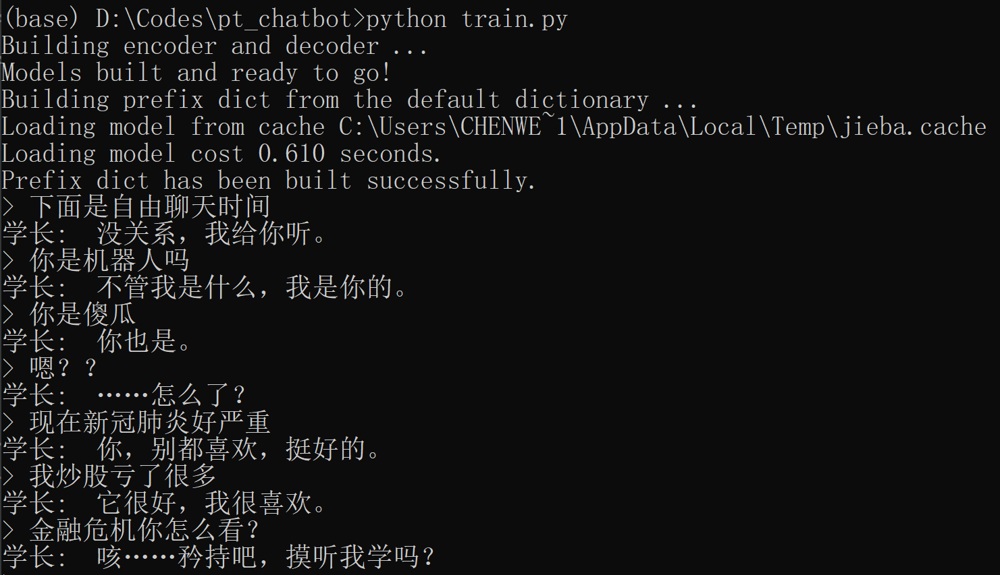
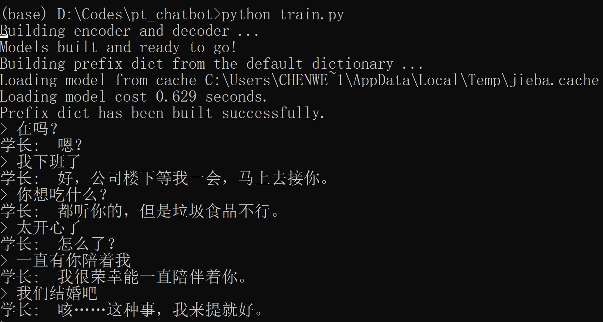

# Requirements
 - PyTorch 1.2.0
 - Jieba 0.42.1

# 数据相关
## 训练语料
声明：
由于版权问题，暂时不方便提供我使用的语料，大家可以使用自己收集的语料，建议可尝试使用小黄鸡的语料。

格式：  
问题\t回答 （一个pair占一行）

例子：  
出任务又受伤了？	不碍事的，只是小伤罢了。  
新年快乐	你也是，每天都要快乐。  
可以和我说说你弟弟的事吗？	你很关心这个？

数据量参考：  
对话15000+（偏少），词汇4000+，训练次数50000（语料库够大不需要训练这么多次）

存放路径：  
使用`config.py`的变量`dialogFile`指定对话存放路径

## 预训练词向量
推荐使用fastText使用维基百科训练的词向量，[下载地址](https://fasttext.cc/docs/en/pretrained-vectors.html)

# 运行方法
## 训练模型
1. 运行`generate_voc_pairs.py`生成词汇表和问答pairs
2. 运行`preprocess_emb.py`预处理预训练的词向量（如果不需要预训练词向量可跳过此步骤，`config.py`中）
3. 在`config.py`文件中配置相关参数（参考`config_example.py`）
 - 设置`mode=train`
 - 首次训练设置`loadFilename=None`，如果是接着训练则设置`checkpoint_iter`为上次训练的次数，并设置`loadFilename`为存档地址
4. 运行`train.py`训练模型，训练完后可与机器人对话，输入quit结束

## 测试模型
1. 在`config.py`文件中配置相关参数
 - 设置`mode=evaluate`
 - 设置`checkpoint_iter`为上次训练的次数，并设置`loadFilename`为存档地址
3. 运行`train.py`训练模型，可与机器人对话，输入quit结束

# 训练效果
bot的训练语料全是谈情说爱性质的，所以出现金融危机、covid-19等就会说莫名其妙的话，甚至不成句子，主要是训练语料太少的原因。

如果是一些恋爱用语，bot的回复就很好，当然我训练次数也较多，还额外做了后处理，可能有点过拟合。

# 未来工作
1. 现在的生成模型似乎不会自动停止，总是倾向于生成长回答，所以做了后处理，即在句号或问号处截断生成的回答。这似乎是因为`maskNLLLoss`只计算实际句子长度的loss，之后也许会尝试一下计算完整长度的loss。
2. 生成模型在语料较少的时候还是不太靠谱，训练次数少的话甚至不能生成符合语法结构的句子，所以想加入用embedding进行文本检索的模块。如果检索到的句子匹配度较低，才调用生成模型。
3. 结果嵌入web，尝试用torchscript部署。

# 参考
http://fancyerii.github.io/2019/02/14/chatbot/

# 改进
1. Fix原教程中的一些bug
2. 支持对话中出现单词表中不包含的单词
3. 支持载入预训练的词向量
4. 支持中文会话
