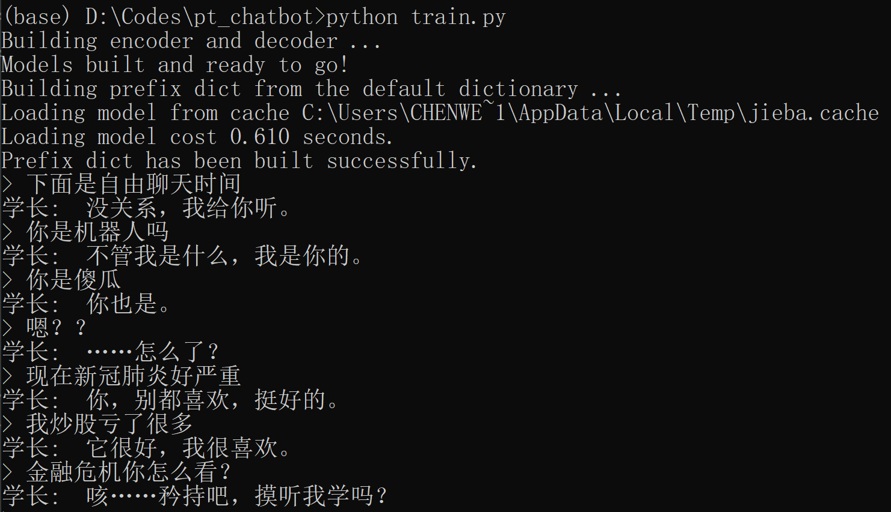
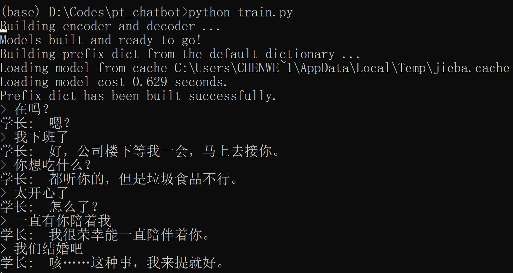

[一个姑且算是聊天机器人的教程](https://www.jianshu.com/p/e7bf16d7a33a)放了一些比较琐碎不适合放在`README`里的内容。

# Requirements
 - python 3.7.4
 - PyTorch 1.2.0
 - jieba 0.42.1
 - flask 1.1.1
 - gensim 3.8.0 
 - annoy 1.16.3 
 - scikit-learn 0.21.3

# 数据相关
## 训练语料
声明：
由于版权问题，暂时不方便提供我使用的语料，大家可以使用自己收集的语料，建议可尝试使用小黄鸡的语料。

格式：  
问题\t回答 （一个pair占一行）

例子：  
出任务又受伤了？	不碍事的，只是小伤罢了。  
新年快乐	你也是，每天都要快乐。  
可以和我说说你弟弟的事吗？	你很关心这个？

数据量参考：  
对话19000+（偏少），词汇4000+，训练次数20000  

存放路径：  
使用`config.py`的变量`dialogFile`指定对话存放路径

## 预训练词向量
推荐使用fastText使用维基百科训练的词向量，[下载地址](https://fasttext.cc/docs/en/pretrained-vectors.html)

# 运行方法
## 生成模型
生成模型参考了pytorch的chatbot教程，主要是seq2seq模型+attention。
### 训练模型
1. 运行`generate_voc_pairs.py`生成词汇表和问答pairs
2. 运行`preprocess_emb.py`预处理预训练的词向量（如果不需要预训练词向量可跳过此步骤，`config.py`中设置`embeddingFile`为`None`即可）
3. 在`config.py`文件中配置相关参数（参考`config_example.py`）
 - 设置`mode="train"`
 - 首次训练设置`loadFilename=None`，如果是接着训练则设置`checkpoint_iter`为上次训练的次数，并设置`loadFilename`为存档地址
4. 运行`train.py`训练模型，训练完后可与机器人对话，输入quit结束

### 测试模型
1. 在`config.py`文件中配置相关参数
 - 设置`mode="evaluate"`
 - 设置`checkpoint_iter`为上次训练的次数，并设置`loadFilename`为存档地址
2. 运行`train.py`训练模型，可与机器人对话，输入quit结束

## 检索模型
检索模型主要就是将句子表示成向量后，搜索最近邻（KNN）。实现的三个不同的模型主要在速度和准确性上稍有区别。
1. 将`gensim`加载`fastText`词向量后得到的模型存储在路径`fastTextGensim`下。（具体见`compute_sent_emb.py`的注释部分）
2. 运行`compute_sent_emb.py`完成三个检索模型所需要的准备工作：
 - 计算知识库中所有句子的句向量保存`sentEmbFile`
 - 创建annoy index备查 
 - 创建ball tree对象备查
3. `config.py`中的`retrieve_mode`支持`brute_force`, `annoy`和`ball_tree`三种方式，设置需要的检索模型后运行`retrieval.py`。其中brute force速度比较慢，但是准确性有保证，annoy速度最快，数据量级上去了也没问题，但是结果可能比brute force稍差，不过我目测了基本差不多。

## 混合模型
混合模型综合了生成模型和检索模型的结果，当检索模型召回的answer与用户输入的query相似度不满足阈值条件则进一步调用生成模型返回结果。前两个模型都跑通的话可以用如下方法运行混合模型：
1. 运行`hybrid_model.py`，可与机器人对话，输入quit结束

## 网页版本
1. 网页版目前接的是生成模型+annoy检索，运行`app.py`，服务器启动后会输出服务器地址，如`http://127.0.0.1:5000/`
2. 在浏览器中输入地址，和机器人对话

# 训练效果
## 生成模型
bot的训练语料全是谈情说爱性质的，所以出现金融危机、covid-19等就会说莫名其妙的话，甚至不成句子，主要是训练语料太少的原因。  
  
如果是一些恋爱用语，bot的回复就很好，当然我训练次数也较多，还额外做了后处理，可能有点过拟合。  
  

## 网页版本
网页版效果如图所示   
  

# 未来工作
1. 部署上线（么得机器哈哈哈）。
2. 增加调教功能以用于收集更多语料（因为暂时没法上线，这功能做了也没用啊，没人调教）。

# 参考
http://fancyerii.github.io/2019/02/14/chatbot/  
https://github.com/llSourcell/tensorflow_chatbot

# 改进
1. 添加用来打底的检索模型
2. 支持对话中出现单词表中不包含的单词
3. 支持载入预训练的词向量
4. 支持中文会话
5. 更改loss function
6. 支持GUI
